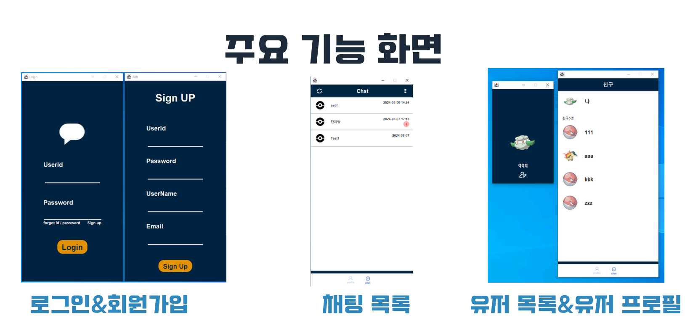
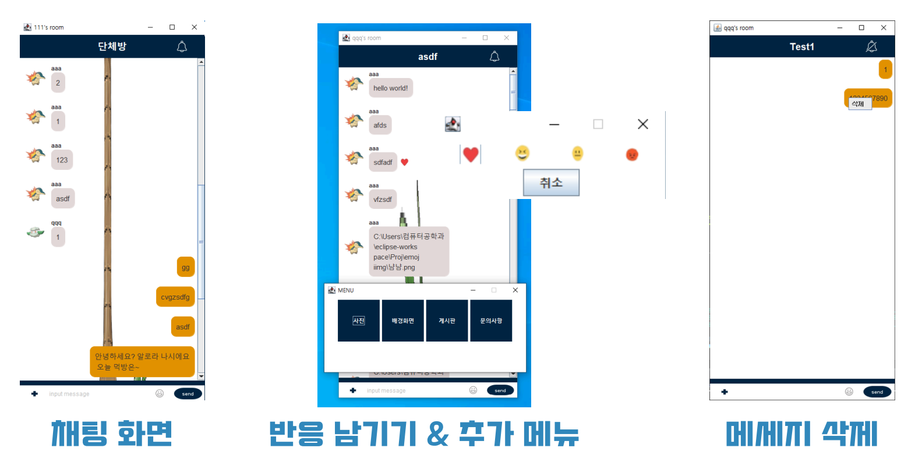
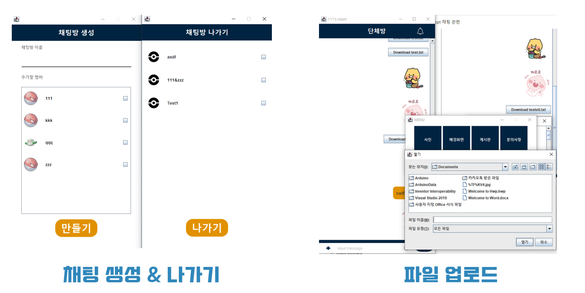
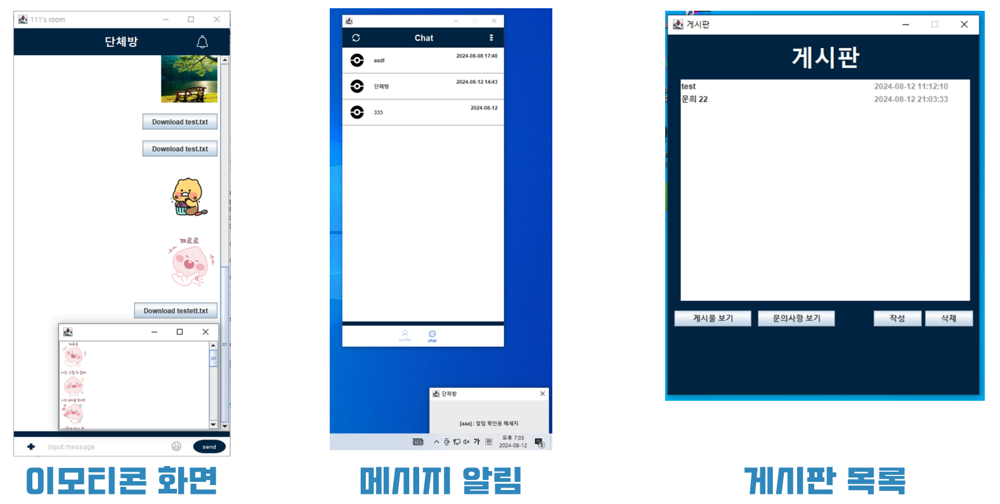
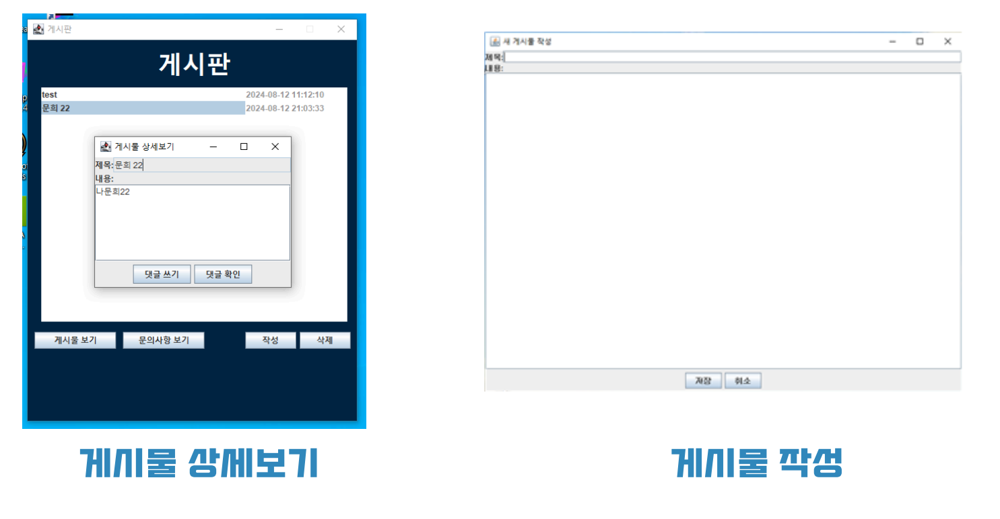
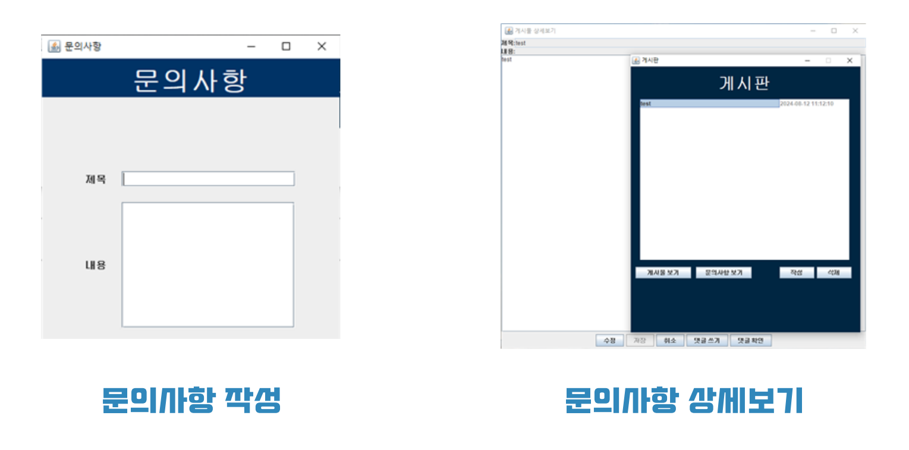

# Java Chat

## 개요
해당 프로젝트는 자바를 사용하여 채팅 소프트웨어를 만드는 프로젝트 입니다.

## 주요기능
- 채팅
- 게시판
- 알림기능

## 화면

- 로그인과 회원가입을 할 수 있습니다.
- 아이디와 비밀번호찾기를 통해 아이디와 비밀번호를 찾을 수 있습니다.
    - 찾는 항목은 이메일로 정보가 전송이 됩니다.
- 여러개의 채팅방을 만들 수 있습니다.
    - 개인 채팅과 단체 채팅을 만들 수 있습니다.
    - 채팅목록에서 읽지 않는 메시지의 개수를 알 수 있습니다.
    - 새로고침 버튼을 통해 채팅방 목록의 정보를 갱신 할 수 있습니다.
- 친구 메뉴에서 친구들의 정보를 확인 할 수 있습니다.
- 프로필 수정을 통해 자신의 프로필 이미지를 바꿀 수 있습니다.

- 채팅방 내에서는 채팅 목록을 확인할 수 있습니다.
- 채팅을 보낼 수 있습니다.
- 메시지의 삭제가 가능합니다.
- 이모티콘 및 사진을 전송할 수 있고 채팅방의 배경화면을 바꿀 수 있습니다.
- 메시지 개별마다 반응을 남길 수 있습니다.

- 채팅방을 생성하고 나갈 수 있습니다.

- 상대방에게 채팅이 올때 해당 채팅방을 보고있지 않다면 해당 채팅방에 대한 알림을 받을 수 있습니다.

- 게시판을 사용하여 사람들과 소통할 수 있습니다.
- 댓글을 남길 수 있습니다.